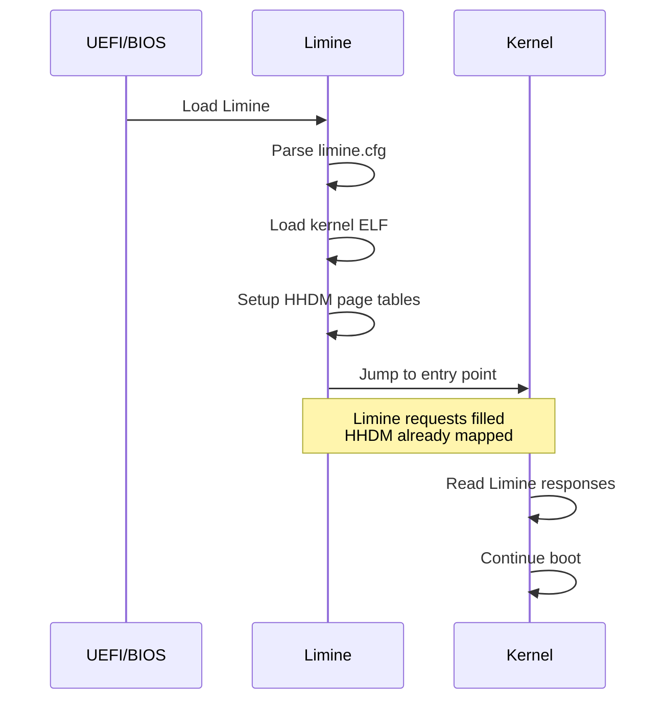

# Boot Compartment

TEAM_316: Simplified to Limine-only boot (Unix philosophy: do one thing well).

## Limine Boot Protocol

Limine is the sole boot protocol for x86_64. It provides:

- **HHDM** (Higher Half Direct Map) - All physical memory mapped
- **Memory map** - Detailed physical memory regions
- **Framebuffer** - Optional graphics output
- **Kernel/module addresses** - Where things are loaded

### Boot Handoff



## Why Limine Only?

| Feature | Limine | Multiboot |
|---------|--------|-----------|
| HHDM mapping | ✅ Complete | ❌ Manual setup |
| 64-bit native | ✅ Yes | ❌ Starts 32-bit |
| UEFI support | ✅ Yes | ⚠️ Limited |
| Memory map | ✅ Detailed | ✅ Basic |
| Complexity | Low | High |

**Result**: Simpler code, fewer bugs, better compatibility.

## Limine Requests

The kernel communicates with Limine through request/response structures:

```rust
// In kernel/src/boot/limine.rs
static HHDM_REQUEST: limine::HhdmRequest = limine::HhdmRequest::new();
static MEMMAP_REQUEST: limine::MemmapRequest = limine::MemmapRequest::new();
static KERNEL_ADDRESS: limine::KernelAddressRequest = limine::KernelAddressRequest::new();
```

## Related Files

- `kernel/src/boot/limine.rs` - Limine protocol implementation
- `kernel/src/boot/mod.rs` - Unified BootInfo structure
- `limine.cfg` - Limine configuration file
