# CPU Compartment

This compartment handles CPU-level structures and state management for x86_64.

## Files

| File | Description |
|------|-------------|
| `gdt.rs` | Global Descriptor Table and Task State Segment |
| `idt.rs` | Interrupt Descriptor Table |
| `exceptions.rs` | Exception handlers and IRQ dispatch |

## GDT (Global Descriptor Table)

The GDT defines memory segments for the CPU. In 64-bit long mode, segmentation is mostly disabled, but we still need segments for:
- Kernel/user privilege separation (Ring 0 vs Ring 3)
- TSS for stack switching on privilege transitions

### Segment Layout

```
Index  Selector  Description
-----  --------  -----------
0      0x00      Null descriptor (required)
1      0x08      Kernel Code (DPL=0, Long mode)
2      0x10      Kernel Data (DPL=0)
3      0x18      User Data (DPL=3)
4      0x20      User Code (DPL=3, Long mode)
5      0x28      TSS (64-bit, spans 2 entries)
```



```mermaid
flowchart LR
    subgraph Ring 0 - Kernel
        KC[Kernel Code<br/>0x08]
        KD[Kernel Data<br/>0x10]
    end
    
    subgraph Ring 3 - User
        UC[User Code<br/>0x23]
        UD[User Data<br/>0x1B]
    end
    
    subgraph TSS
        T[Task State Segment<br/>0x28]
    end
    
    KC --> T
    UC --> T
```

### Selector Values

| Constant | Value | Description |
|----------|-------|-------------|
| `KERNEL_CODE` | `0x08` | Kernel code segment |
| `KERNEL_DATA` | `0x10` | Kernel data segment |
| `USER_DATA` | `0x1B` | User data (0x18 \| 3) |
| `USER_CODE` | `0x23` | User code (0x20 \| 3) |
| `TSS_SELECTOR` | `0x28` | Task State Segment |

## TSS (Task State Segment)

The TSS stores stack pointers for privilege level transitions:

```mermaid
flowchart TD
    subgraph TSS Structure
        RSP0[rsp0 - Ring 0 stack<br/>Used when entering kernel]
        RSP1[rsp1 - Ring 1 stack<br/>Unused]
        RSP2[rsp2 - Ring 2 stack<br/>Unused]
        IST[ist[0-6] - Interrupt Stacks<br/>For specific exceptions]
    end
    
    USER[User Mode<br/>Ring 3] -->|Interrupt/Syscall| RSP0
    RSP0 --> KERNEL[Kernel Mode<br/>Ring 0]
```

### Key Function

```rust
/// Set the kernel stack for Ring 0 transitions
pub fn set_kernel_stack(stack_top: usize)
```

Called when switching tasks to ensure interrupts use the correct kernel stack.

## IDT (Interrupt Descriptor Table)

The IDT maps interrupt vectors (0-255) to handler functions:


### IDT Entry Format

Each entry is 16 bytes containing:
- Handler address (split across 3 fields)
- Segment selector (always kernel code 0x08)
- Type/attributes (interrupt gate, present, DPL)
- IST index (optional alternate stack)

## Exceptions

Exception handlers for CPU faults:

| Vector | Name | Has Error Code |
|--------|------|----------------|
| 0 | Divide Error | No |
| 6 | Invalid Opcode | No |
| 8 | Double Fault | Yes (always 0) |
| 13 | General Protection | Yes |
| 14 | Page Fault | Yes |
| 32+ | Hardware IRQs | No |

### Exception Flow


### IRQ Dispatch

Hardware IRQs (vectors 32+) go through `irq_dispatch()`:

1. Call registered handler via APIC dispatch
2. Send EOI (End of Interrupt) to PIC/APIC
3. Return via `iretq`

## Initialization Order


## Usage Example

```rust
// During HAL init
unsafe { gdt::init() };  // Load GDT and TSS
idt::init();              // Load IDT
exceptions::init();       // Register handlers

// When switching tasks
gdt::set_kernel_stack(new_task.kernel_stack_top);
```
