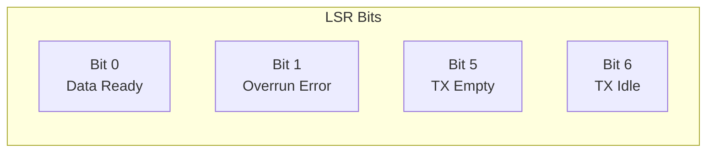
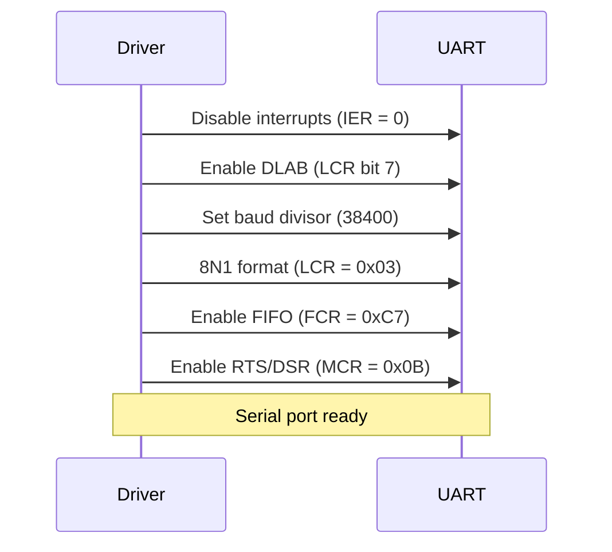
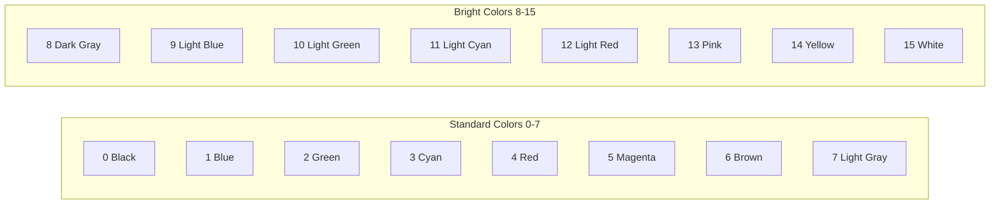
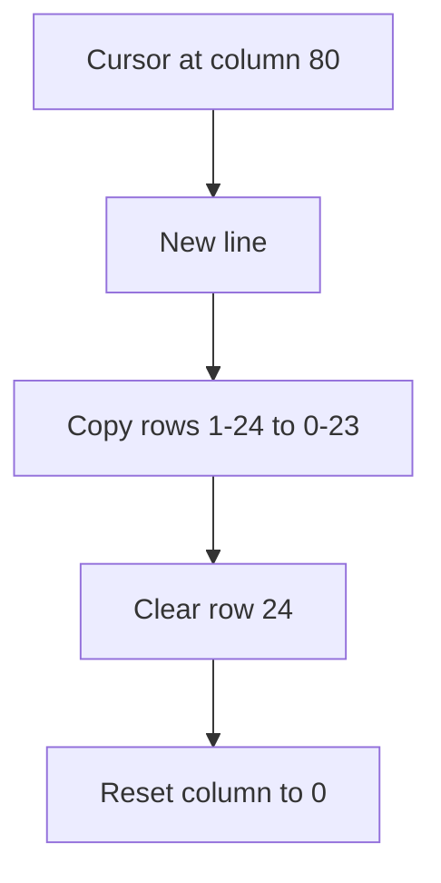
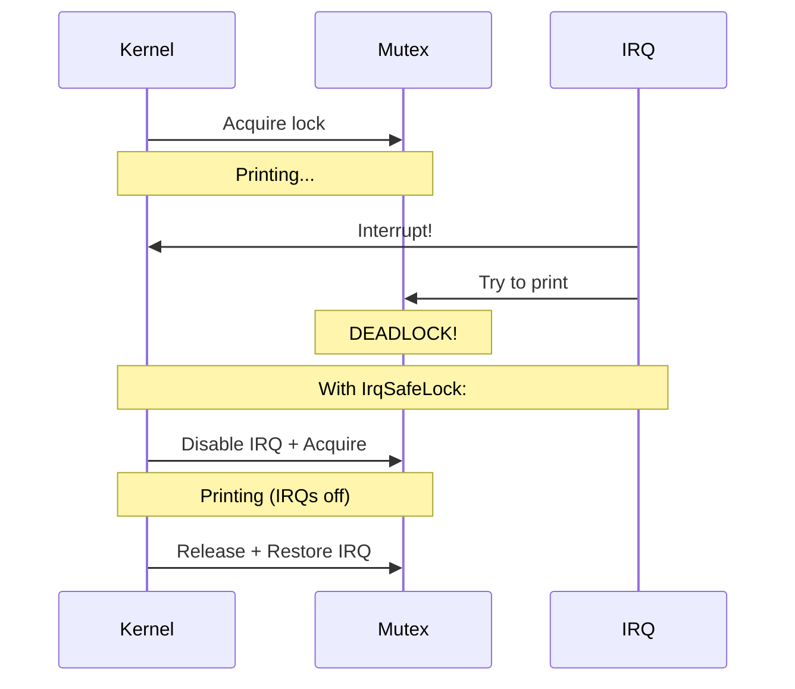
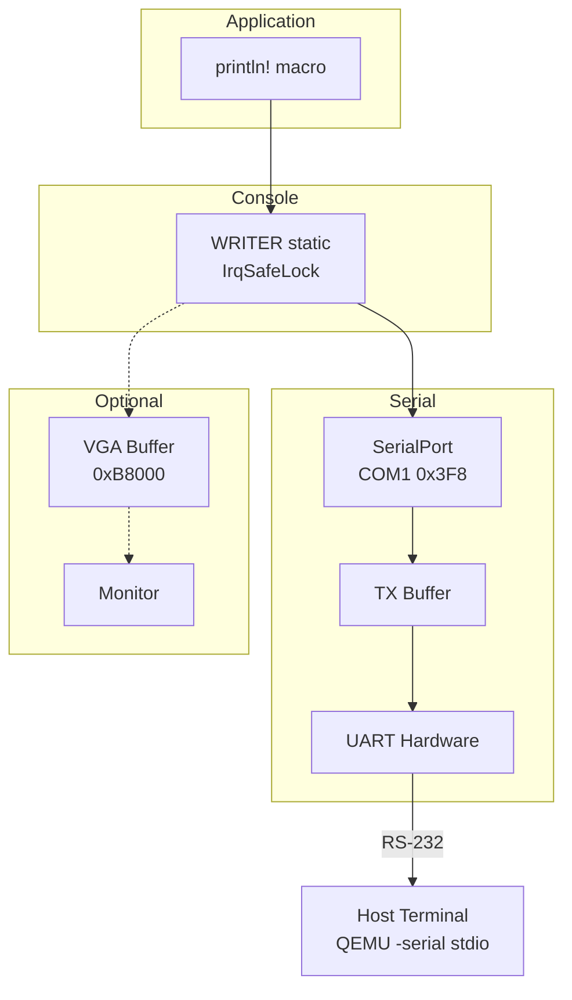

# I/O Compartment

This compartment handles input/output devices for x86_64.

## Files

| File | Description |
|------|-------------|
| `serial.rs` | COM1 serial port driver |
| `vga.rs` | VGA text mode buffer |
| `console.rs` | Unified console writer abstraction |

## Serial Port (`serial.rs`)

The serial port provides early debug output before other subsystems are ready.

### COM Port Addresses

| Port | I/O Base | IRQ |
|------|----------|-----|
| COM1 | `0x3F8` | 4 |
| COM2 | `0x2F8` | 3 |
| COM3 | `0x3E8` | 4 |
| COM4 | `0x2E8` | 3 |

**LevitateOS uses COM1 (0x3F8)** for debug output.

### Register Layout

```
Base + 0: Data Register (R/W)
Base + 1: Interrupt Enable Register
Base + 2: FIFO Control Register
Base + 3: Line Control Register
Base + 4: Modem Control Register
Base + 5: Line Status Register
Base + 6: Modem Status Register
Base + 7: Scratch Register
```

### Line Status Register (Base + 5)



### Initialization Sequence



### Baud Rate

```
Divisor = 115200 / desired_baud
For 38400 baud: divisor = 3
```

### API

```rust
impl SerialPort {
    /// Create a new serial port
    pub const fn new(base_port: u16) -> Self
    
    /// Initialize the serial port
    pub unsafe fn init(&self)
    
    /// Send a byte (blocking)
    pub fn send(&self, data: u8)
    
    /// Receive a byte (blocking)
    pub fn receive(&self) -> u8
    
    /// Try to read a byte (non-blocking)
    pub fn read_byte(&self) -> Option<u8>
}

// Implements fmt::Write for print! macros
impl fmt::Write for SerialPort
```

## VGA Text Mode (`vga.rs`)

VGA text mode provides 80x25 character display.

### Memory Layout

```
Physical: 0xB8000 - 0xB8FA0 (4000 bytes)
Virtual:  phys_to_virt(0xB8000)
```

### Character Format

Each character cell is 2 bytes:

```
┌─────────────────┬─────────────────┐
│ Byte 0 (even)   │ Byte 1 (odd)    │
├─────────────────┼─────────────────┤
│ ASCII Character │ Attribute       │
└─────────────────┴─────────────────┘

Attribute byte:
┌───┬───┬───┬───┬───┬───┬───┬───┐
│ 7 │ 6 │ 5 │ 4 │ 3 │ 2 │ 1 │ 0 │
├───┴───┴───┴───┼───┴───┴───┴───┤
│  Background   │  Foreground   │
└───────────────┴───────────────┘
```

### Colors



### Screen Dimensions

| Property | Value |
|----------|-------|
| Width | 80 columns |
| Height | 25 rows |
| Total cells | 2000 |
| Buffer size | 4000 bytes |

### VgaWriter

```rust
pub struct VgaWriter {
    column_position: usize,
    color_code: ColorCode,
}

impl VgaWriter {
    /// Write a single byte
    pub fn write_byte(&mut self, byte: u8)
    
    /// Write a string
    pub fn write_string(&mut self, s: &str)
}
```

### Scrolling

When the cursor reaches the end of the last line:



## Console (`console.rs`)

The console provides a unified, IRQ-safe interface for output.

### Static Writer

```rust
pub static WRITER: IrqSafeLock<SerialPort> = 
    IrqSafeLock::new(SerialPort::new(COM1));
```

### Why IrqSafeLock?



### Usage

```rust
// Via los_hal macros
los_hal::println!("Hello, world!");

// Direct access
{
    let mut writer = WRITER.lock();
    write!(writer, "Value: {}", 42).unwrap();
}
```

## Output Flow



## Diagnostic Output

Early boot uses direct port I/O for diagnostics:

```rust
// Direct serial output (before console init)
unsafe {
    core::arch::asm!(
        "mov dx, 0x3f8",
        "mov al, 'X'",
        "out dx, al",
        out("ax") _,
        out("dx") _
    );
}
```

This is used in `boot.S` and early HAL init to trace boot progress.
