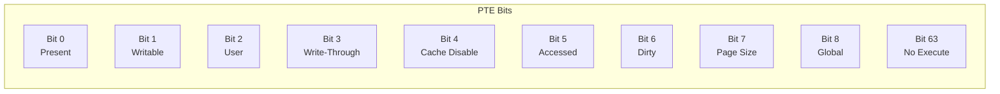
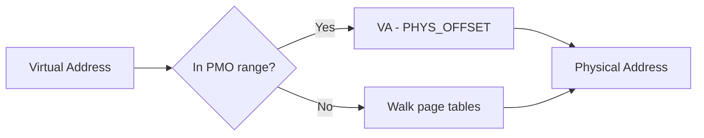
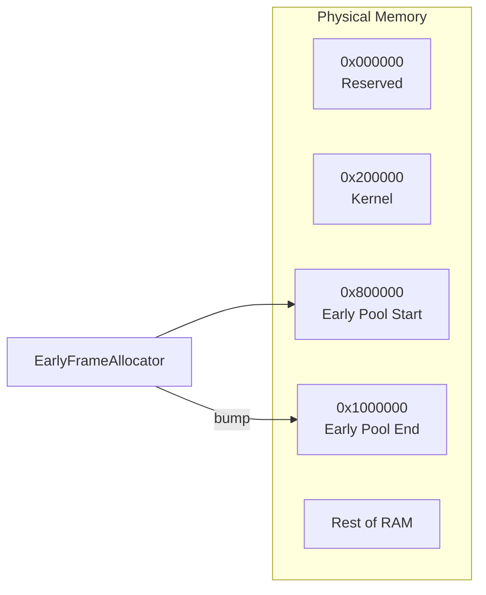
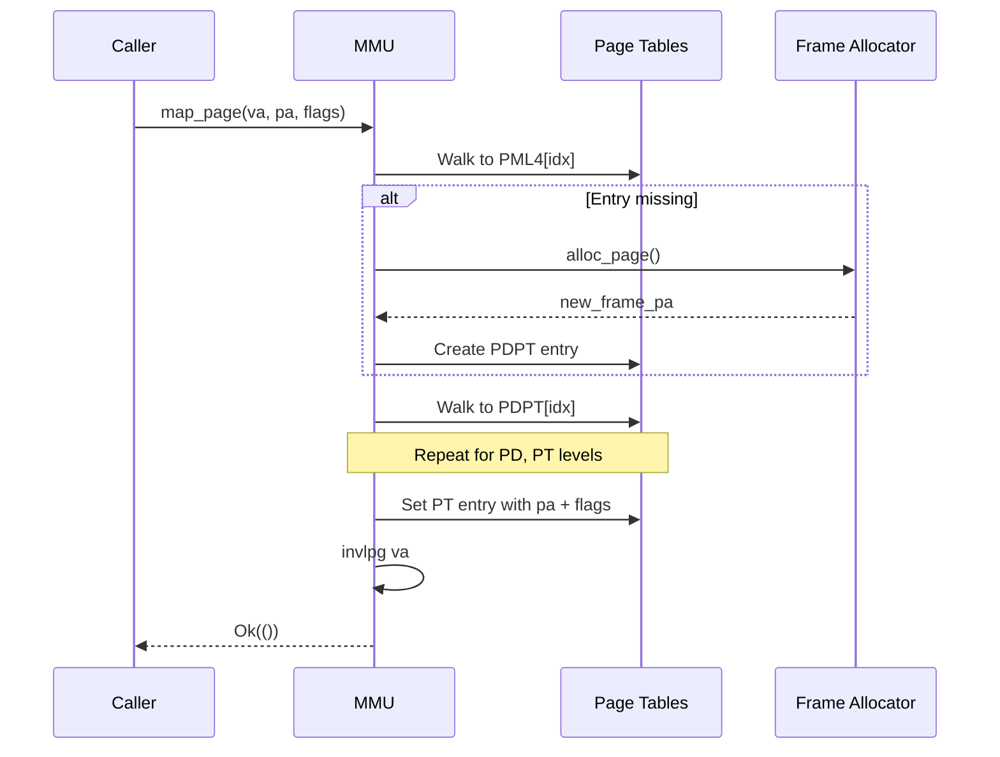

# Memory Management Compartment

This compartment handles all memory-related functionality for x86_64.

## Files

| File | Description |
|------|-------------|
| `paging.rs` | 4-level page table structures and operations |
| `mmu.rs` | Memory mapping, address translation |
| `frame_alloc.rs` | Early bump allocator for page frames |

## x86_64 Virtual Address Space

```
0xFFFFFFFFFFFFFFFF ┌─────────────────────────┐
                   │                         │
                   │   Kernel Higher-Half    │
0xFFFFFFFF80000000 ├─────────────────────────┤ KERNEL_VIRT_BASE
                   │                         │
                   │   Physical Memory       │
                   │   Offset (PMO/HHDM)     │
0xFFFF800000000000 ├─────────────────────────┤ PHYS_OFFSET
                   │                         │
                   │   Non-canonical hole    │
                   │   (not addressable)     │
                   │                         │
0x0000800000000000 ├─────────────────────────┤
                   │                         │
                   │   User Space            │
                   │                         │
0x0000000000000000 └─────────────────────────┘
```

## 4-Level Paging

x86_64 uses 4-level page tables (with optional 5-level for larger address space):

```mermaid
flowchart TD
    VA[Virtual Address<br/>48 bits used]
    
    subgraph Address Breakdown
        PML4I[PML4 Index<br/>bits 47:39]
        PDPTI[PDPT Index<br/>bits 38:30]
        PDI[PD Index<br/>bits 29:21]
        PTI[PT Index<br/>bits 20:12]
        OFF[Offset<br/>bits 11:0]
    end
    
    VA --> PML4I
    VA --> PDPTI
    VA --> PDI
    VA --> PTI
    VA --> OFF
    
    subgraph Page Tables
        PML4[PML4<br/>Page Map Level 4<br/>512 entries]
        PDPT[PDPT<br/>Page Directory Pointer<br/>512 entries]
        PD[PD<br/>Page Directory<br/>512 entries]
        PT[PT<br/>Page Table<br/>512 entries]
    end
    
    CR3[CR3 Register] --> PML4
    PML4 -->|entry[PML4I]| PDPT
    PDPT -->|entry[PDPTI]| PD
    PD -->|entry[PDI]| PT
    PT -->|entry[PTI]| FRAME[Physical Frame]
    FRAME -->|+ Offset| PA[Physical Address]
```

### Page Sizes

| Size | Level | Bits | Use Case |
|------|-------|------|----------|
| 4KB | PT (Level 1) | 12 | Normal pages |
| 2MB | PD (Level 2) | 21 | Huge pages, PMO mapping |
| 1GB | PDPT (Level 3) | 30 | Giant pages (if supported) |

## Page Table Entry Flags



### PageFlags Constants

| Flag | Value | Description |
|------|-------|-------------|
| `PRESENT` | `1 << 0` | Page is mapped |
| `WRITABLE` | `1 << 1` | Page is writable |
| `USER_ACCESSIBLE` | `1 << 2` | User mode can access |
| `NO_EXECUTE` | `1 << 63` | Execution disabled (NX) |

### Preset Combinations

| Preset | Flags | Use |
|--------|-------|-----|
| `KERNEL_CODE` | Present | Kernel code sections |
| `KERNEL_DATA` | Present + Writable | Kernel data/BSS |
| `USER_CODE` | Present + User | User code pages |
| `USER_DATA` | Present + Writable + User | User data/stack |
| `DEVICE` | Present + Writable | MMIO regions |

## Address Translation

### Virtual to Physical



```rust
/// Convert virtual address to physical
pub fn virt_to_phys(va: usize) -> usize
```

### Physical to Virtual


```rust
/// Convert physical address to virtual (via PMO)
pub fn phys_to_virt(pa: usize) -> usize
```

## Early Frame Allocator

A simple bump allocator used during early boot before the buddy allocator is ready:



### Allocation Range

| Address | Description |
|---------|-------------|
| `0x800000` | Early pool start (8MB) |
| `0x1000000` | Early pool end (16MB) |
| 8MB total | Available for early page tables |

### Characteristics

- **Bump allocator**: Only increments, never frees
- **Lock-free**: Uses atomic operations
- **Temporary**: Only used until buddy allocator is ready
- **Match required**: Range must match kernel memory reservation

## Key Constants

| Constant | Value | Description |
|----------|-------|-------------|
| `PAGE_SIZE` | `0x1000` (4KB) | Standard page size |
| `PAGE_SHIFT` | `12` | Log2 of page size |
| `KERNEL_VIRT_BASE` | `0xFFFFFFFF80000000` | Kernel higher-half |
| `PHYS_OFFSET` | `0xFFFF800000000000` | Physical memory offset |
| `ENTRIES_PER_TABLE` | `512` | PTEs per page table |

## MMU Operations

### Mapping a Page



### Unmapping a Page

```rust
pub fn unmap_page(root: &mut PageTable, va: usize) -> Result<(), MmuError>
```

1. Walk page tables to find entry
2. Clear the PTE
3. Invalidate TLB with `invlpg`

## Known Issues (TEAM_316)

### PMO Limited to 1GB

The early page tables only map the first 1GB of physical memory via PMO:

```
PMO maps: 0x00000000 - 0x3FFFFFFF (1GB)
APIC at:  0xFEE00000 (~4GB) - NOT MAPPED!
```

**Impact**: `phys_to_virt()` returns unmapped addresses for APIC/IOAPIC.

**Workaround**: APIC regions identity-mapped by assembly boot code.

**Fix needed**: Extend PMO to cover 4GB+ or use identity mapping.
